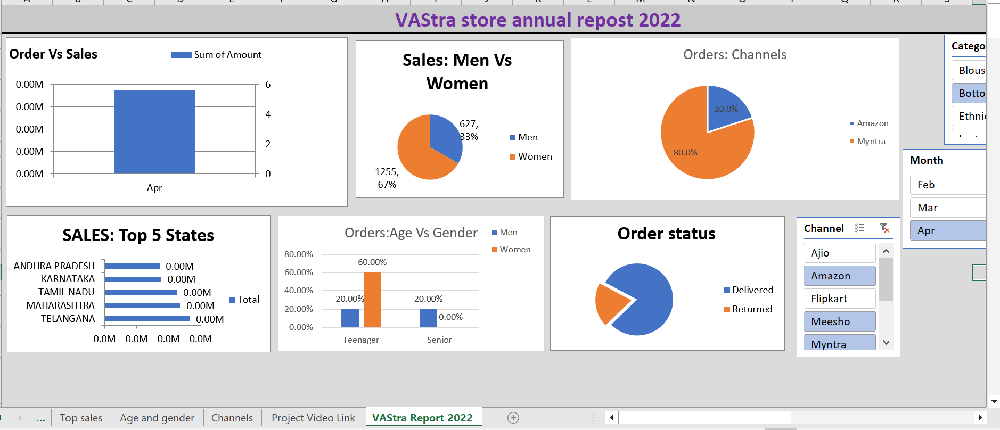

# 📊 Vrinda Store Data Analysis

## 📝 Project Overview
This project focuses on analyzing sales data from **Vrinda Store** to uncover key business insights, trends, and performance metrics. The analysis was carried out using **Excel**, with dashboards and visualizations created to support data-driven decision-making.

---

## 📸 Dashboard Preview

---

## 📂 Dataset Description
The dataset contains transactional data from Vrinda Store, including:

- Order details  
- Customer information  
- Sales and revenue  
- Product categories  
- Order status  
- Sales channels  
- Demographics (age & gender)  

---

## 📁 File Structure
The Excel file contains multiple sheets used for analysis:

- **VAStra Store** → Raw dataset  
- **Order Vs Sales** → Sales trend over time  
- **Men Vs Women** → Gender-based sales comparison  
- **Order Status** → Delivery status breakdown  
- **Top Sales** → Best-performing products/categories  
- **Age and Gender** → Customer segmentation  
- **Channels** → Sales by platform (Amazon, Flipkart, etc.)  
- **VAStra Report 2022** → Final dashboard/report  

---

## 🎯 Objectives
- Analyze overall sales performance  
- Identify top-selling products and categories  
- Compare sales across gender and age groups  
- Evaluate order status distribution  
- Understand sales channel effectiveness  
- Build an interactive dashboard for insights  

---

## 🛠 Tools Used
- **Microsoft Excel**
  - Pivot Tables  
  - Charts & Graphs  
  - Data Cleaning  
- **Power BI (optional)**  
- **Python (optional)**  

---

## 📊 Key Insights
- Women customers contribute more to total sales than men (~67%)  
- A few sales channels dominate total orders (e.g., Myntra ~80%)  
- Most orders are successfully delivered with low return rates  
- Adult/teen segments show stronger purchasing activity  
- Top states contribute significantly to total revenue  

---

## 📈 Dashboard Features
- Sales vs Orders trend visualization  
- Gender-based purchase comparison  
- Channel-wise sales distribution  
- Order status breakdown  
- Top-performing states  

---

## 🚀 How to Use
1. Download or clone this repository  
2. Open the Excel file  
3. Navigate through sheets for analysis  
4. View the final dashboard in **VAStra Report 2022**  

---

## 📌 Conclusion
This analysis provides valuable insights into customer behavior, sales performance, and growth opportunities for Vrinda Store. The dashboard enables better business decision-making through data visualization.

---

## 📎 Project Status
✅ Completed  
📊 Dashboard Ready  
📁 Dataset Cleaned  

---

## 👤 Author
**Okoroji Promise**  
- Data Analyst (Excel | Power BI | Python)
